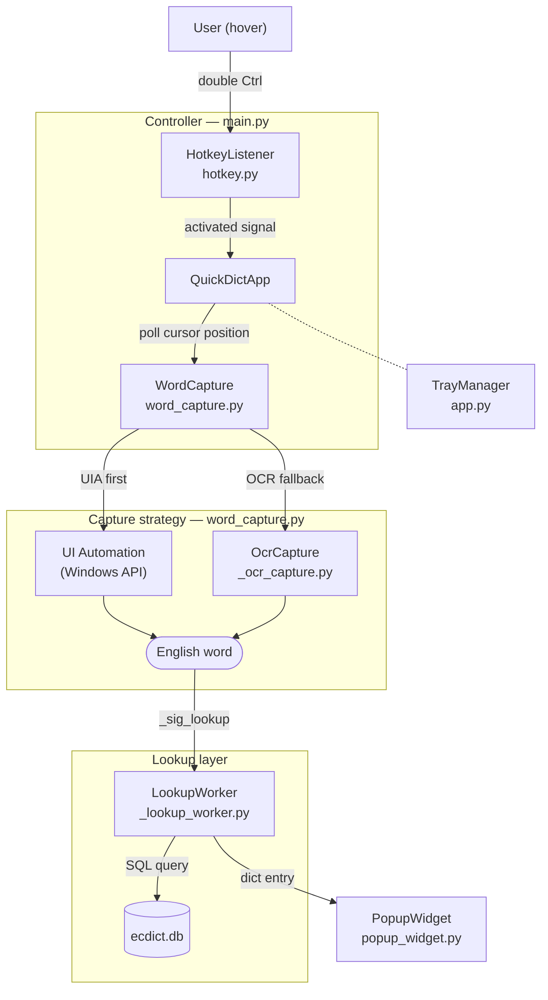

# QuickDict — 屏幕取词翻译工具

基于 ECDICT 词典数据库的 Windows 屏幕取词翻译工具。

## 功能

- 连按两次 Ctrl 激活取词模式，Esc 退出
- 鼠标悬停自动取词翻译，弹出美观的翻译卡片
- 系统托盘常驻，右键菜单控制
- 支持词形还原（lemma）、模糊匹配

## 架构



## 开发环境

### 首次安装

```batch
setup.bat
```

该脚本自动完成：创建虚拟环境 → 安装依赖 → 构建词典数据库。

> 数据库构建需要 `stardict/stardict.csv`（完整版 340 万词条）。

### 运行（开发模式）

```batch
.venv\Scripts\python -m quickdict.main
```

### 项目结构

```
quickdict/
  main.py           程序入口 & 主控制器
  config.py          路径常量 & 环境检测（开发/打包）
  app.py             系统托盘管理（TrayManager）、状态指示器（StatusIndicator）
  dict_engine.py     词典查询引擎（多级回退）
  hotkey.py          全局快捷键监听（双击 Ctrl）
  word_capture.py    屏幕取词（UI Automation + OCR）
  popup_widget.py    翻译弹窗 UI
  _ocr_capture.py    OCR 截屏取词（多策略预处理 + dxcam 回退）
  _ocr_preprocess.py 图像预处理变体生成（CLAHE/二值化/形态学/放大）
  _capture_overlay.py 截图区域可视化（调试用）
  _formatter.py      词典数据格式化
  _word_utils.py     文本处理工具
  _db_importer.py    CSV 导入 SQLite
  _lemma_builder.py  Lemma 反查表构建
  _lookup_worker.py  后台查词线程
  build_db.py        数据库构建 CLI
  assets/
    icon.png         托盘图标
  styles/
    popup.qss        弹窗样式表
data/
  ecdict.db          词典数据库（~800MB，不入 Git）
```

## 打包发布

### 一键打包

```batch
build_release.bat
```

脚本自动完成：PyInstaller 打包 → 整理发布目录 → 分离程序与数据库。

### 产出目录

```
release/
  QuickDict/              ← 程序包（分发给用户）
    QuickDict.exe
    _internal/            ← 运行时依赖（必须保留）
  QuickDict-data/         ← 数据库包（单独分发）
    data/
      ecdict.db
```

### 部署方式

1. 将 `release/QuickDict/` 整个文件夹复制到目标机器
2. 将 `release/QuickDict-data/data/` 文件夹复制到 `QuickDict/` 下

最终用户目录结构：

```
QuickDict/
  QuickDict.exe
  _internal/
  data/
    ecdict.db
```

双击 `QuickDict.exe` 即可运行。

### 设计说明

| 资源 | 位置 | 原因 |
|------|------|------|
| icon.png, popup.qss, stardict.py | 打包进 exe（`_internal/`） | 小文件，必须跟随程序 |
| ecdict.db（~800MB） | exe 同级 `data/` 目录 | 太大不适合打包进 exe，便于独立更新 |

路径兼容通过 `config.py` 中的 `FROZEN` 检测实现：
- 开发模式：`__file__` 推导路径
- 打包模式：`sys._MEIPASS`（内置资源）+ `sys.executable`（外置数据）
